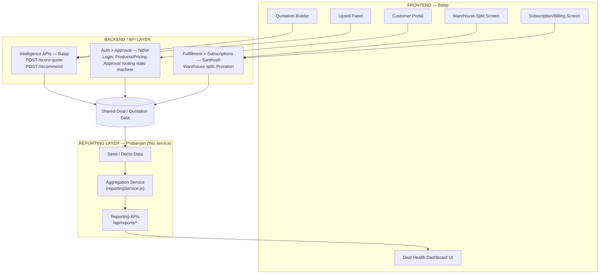

# Clinch — Architecture Overview

One-page view of how the four modules fit together. Prabanjan's reporting
layer sits at the bottom of the stack: it reads what everyone else produces
and hands Balaji's dashboard a clean summary.

## Diagram



### ASCII fallback (if Mermaid isn't rendered)

```text
                       FRONTEND
                         Balaji
                            |
                            v
                    Backend / API Layer
                            |
        +-------------------+-------------------+
        |                   |                   |
        v                   v                   v
   Intelligence          Approval           Fulfillment
     Balaji                Nithin             Santhosh
   /score-quote      Auth, Pricing,        Warehouse split,
   /recommend        Approval routing      Subscriptions/Proration
        |                   |                   |
        +-------------------+-------------------+
                            |
                            v
                Shared Deal / Quotation Data
                            |
                            v
                    Reporting Layer
                       Prabanjan
              (this service: seed data +
               aggregation + /api/reports/*)
                            |
                            v
                  Deal Health Dashboard UI
                          Balaji
```

## Module ownership (strict boundaries)

| Module | Owner | Model |
|---|---|---|
| Risk scoring, explainability, recommendations, AI narrator, all frontend screens | Balaji | Claude Pro |
| Auth, login/signup, magic links, product/price list, discount tiers, approval routing | Nithin | Gemini Pro |
| Warehouse setup/fulfillment, warehouse split, subscriptions, proration | Santhosh | Gemini Pro |
| **Reporting/dashboard data backend, seed data, demo script, this diagram** | **Prabanjan** | This service |

## What Prabanjan's service does and doesn't do

**Does:**
- Owns seed/demo data for customers, sales reps, products, warehouses, and
  deals (`src/data/*.json`).
- Aggregates that data into dashboard-ready JSON (`src/services/reportingService.js`).
- Exposes it over REST (`src/routes/reports.js`).
- Applies one categorization rule — HEALTHY / AT_RISK / STALLED / CLOSED_LOST —
  based on fields that already exist on a deal (risk level, inactivity days,
  workflow stage). It never computes a risk score or routes an approval.

**Does not:**
- Compute risk scores (Balaji).
- Decide approval routing (Nithin).
- Decide warehouse allocation or proration math (Santhosh).
- Render any UI.

## Integration contract for the team

- Balaji's Deal Health Dashboard UI should call `GET /api/reports/dashboard`
  for a single-fetch payload, or the individual `/api/reports/*` endpoints.
- Balaji's risk engine should write `riskScore` / `riskLevel` /
  `riskExplanation` back onto the deal record it's scoring — the reporting
  layer just reads those fields.
- Nithin's approval routing should write `approvalStage` onto the deal
  record as it progresses.
- Santhosh's fulfillment/subscription logic should write `warehouseSplit`
  / `subscription` onto the deal record.
- Sales-rep discount history (`GET /api/reports/sales-rep-discount-history`)
  is the canonical source Balaji's risk engine should call to compare a new
  discount against a rep's own historical average.

Until a shared database exists, this service's own JSON files are the
source of truth for demo purposes; `src/db/store.js` is written as a thin
seam so swapping in a real shared datastore later doesn't require touching
`reportingService.js` or the routes.
